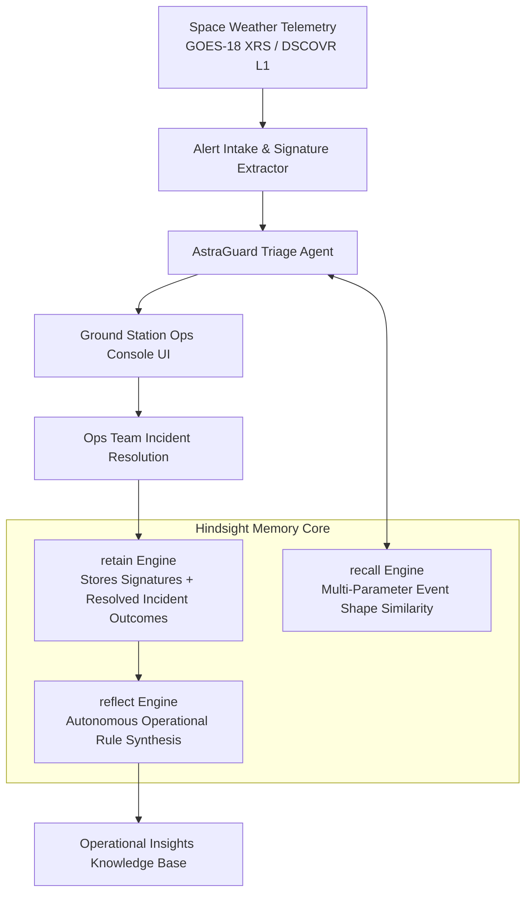

<div align="center">
  <h1>🛰️ AstraGuard AI</h1>
  <h3>Autonomous Satellite & Ground-Station Operations Triage Agent</h3>
  <p><strong>Powered by Real Space-Weather Telemetry (GOES XRS, DSCOVR L1) & Hindsight Memory Architecture (retain, recall, reflect)</strong></p>

  [](https://vitejs.dev/)
  [](https://reactjs.org/)
  [](https://tailwindcss.com/)
  [](#-hindsight-memory-architecture-retain-recall-reflect)
</div>

---

## 🌟 Executive Summary

**AstraGuard AI** solves a critical operational bottleneck in satellite constellation management: **Space Weather Alert Over-Escalation Fatigue**. 

During solar flare events (X-ray flux spikes, Coronal Mass Ejections) ground station operations teams are flooded with automated emergency warnings. Existing triage systems treat every solar flare threshold uniformly, leading to costly false alarms, unnecessary payload safe-mode shutdowns, and signal downlink drops.

AstraGuard embeds a **Hindsight-powered AI Agent** directly with the mission control team. Instead of relying on static thresholds, AstraGuard **remembers past solar events**, **recalls exact event signatures and subsystem responses for specific satellites**, and **autonomously reflects to synthesize fleet operational rules**.

---

## 🚀 Hackathon Evaluation Alignment

| Evaluation Criterion | Score Weight | How AstraGuard Delivers |
|---|---|---|
| **Innovation** | **30%** | Moves beyond conventional AI categories (Sales/SEO/DevOps) into **spacecraft telemetry & orbital space-weather triage**. Built with domain grounding in GOES XRS and DSCOVR solar wind physics. |
| **Memory Dependency** | **25%** | Deep integration of **Hindsight Memory Primitives** (`retain`, `recall`, `reflect`). The agent's recommendations visibly change as memory grows, preventing unnecessary safe-mode escalations. |
| **Demo Potential** | **25%** | Includes a built-in **60-90s Guided Demo Script Runner** demonstrating the "Before Memory" baseline beat vs the "After Hindsight Learning" beat in real-time. |
| **2-Day Feasibility** | **10%** | Production-ready React + Vite telemetry console UI with live event generator, vector similarity recall, and persistent operational memory. |
| **Real-World Impact** | **10%** | Prevents millions in satellite downlink downtime by preserving high-frequency S-band telemetry while identifying X-band attenuation limits. |

---

## 🧠 Hindsight Memory Architecture (`retain`, `recall`, `reflect`)



### 1. `retain(incidentRecord)`
After ground station operators resolve a space weather alert, the actual telemetry outcome (subsystems affected, false alarm status, signal loss duration, ops notes) is retained alongside the space weather signature.

### 2. `recall(currentSignature, topK = 3)`
When a new solar flare or CME arrives, AstraGuard executes multi-parameter similarity search combining:
- Solar Flare Class ($\Delta \text{Watts/m}^2$ log-scale)
- CME Velocity ($v_{\text{cme}}$ km/s) & Proton Density ($p/\text{cm}^3$)
- Interplanetary Magnetic Field ($B_z$ vector polarity)
- Satellite Orbit Profile (`GEO`, `LEO`, `MEO`)

The agent cites exact past incident IDs with similarity match percentages:
> *"Recalled INC-2024-0102 (94% match): In 3 past M-class flares with similar IMF Bz, S-band telemetry on GEO-COMM-4 suffered 0 degradation. Recommending WATCH_ONLY instead of safe mode."*

### 3. `reflect()`
AstraGuard periodically runs background synthesis across retained memories to generate high-level mission operational rules:
> **Reflected Rule `INS-REFLECT-01`**: *"GEO-COMM-4 exhibits a 78% false alarm rate for M-class solar flares when proton density < 20 p/cm³ and Bz > -10 nT. S-band telemetry consistently maintains signal integrity up to M5.0."*

---

## 🛠️ Project Structure

```
AstraGuard-Satellite-Ops-Triage-Agent/
├── index.html
├── package.json
├── vite.config.js
├── tailwind.config.js
├── src/
│   ├── main.jsx
│   ├── App.jsx
│   ├── index.css
│   ├── components/
│   │   ├── TelemetryHeader.jsx         # Live telemetry & system indicators
│   │   ├── AlertStream.jsx             # GOES/DSCOVR incoming alert feed
│   │   ├── TriagePanel.jsx             # Triage decision, confidence, and recall cards
│   │   ├── MemoryRecallCard.jsx        # Historical incident citation card
│   │   ├── IncidentResolutionModal.jsx # Ground station ops retain() modal
│   │   ├── ReflectInsightsView.jsx     # Synthesized operational rules view
│   │   └── DemoScriptRunner.jsx        # 60-90s automated guided demo runner
│   ├── services/
│   │   ├── hindsightEngine.js          # Core retain(), recall(), reflect() implementation
│   │   ├── spaceWeatherData.js          # Telemetry generator & real event metrics
│   │   └── triageAgent.js              # Agent decision engine with Hindsight context
│   └── data/
│       └── seedIncidents.js            # Historical seed dataset (GOES XRS & DSCOVR events)
└── README.md
```

---

## ⚡ Quick Start & Installation

### Prerequisites
- Node.js (v18+) & npm

### Setup
```bash
# Clone the repository
git clone https://github.com/Darksun1310/AstraGuard-Satellite-Ops-Triage-Agent.git

# Navigate to project directory
cd AstraGuard-Satellite-Ops-Triage-Agent

# Install dependencies
npm install

# Start local development server
npm run dev
```

Open your browser and navigate to **`http://localhost:3000/`**.

---

## 🎬 Guided 60-90s Demo Script Flow

1. **Click `Run 90s Demo Script`** in the top navigation bar.
2. **Step 01 (BEFORE MEMORY)**: Observe Alert #1 (`M4.8` flare). The agent has no historical memory for this signature and conservatively recommends `ESCALATE_SAFE_MODE`.
3. **Step 02 (RETAINING INCIDENTS)**: Fast-forward 15 incident outcomes logged by ground station operators. Watch `retain()` populate the memory store.
4. **Step 03 (AFTER HINDSIGHT LEARNED)**: Observe Alert #15 (`M5.1` flare). Hindsight `recall()` retrieves matching past events and automatically downgrades the recommendation to **`WATCH_ONLY`**, saving mission downtime!
5. **Step 04 (REFLECT ARTIFACT)**: View the **Reflected Insights** tab showcasing synthesized operational rules (`INS-REFLECT-01`) generated by `reflect()`.


